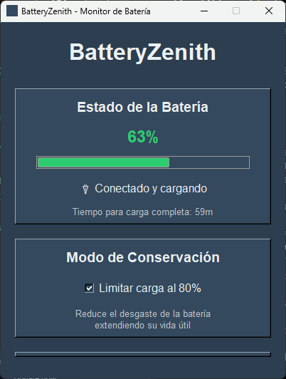
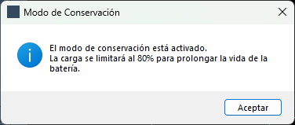
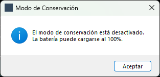
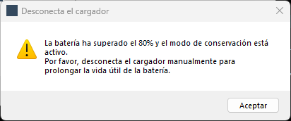
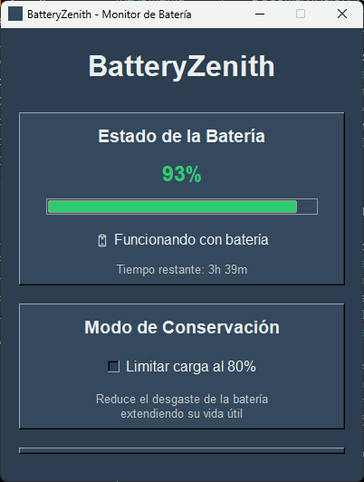

# 🔋 BatteryZenith

<div align="center">


**Una aplicación de escritorio moderna para monitorear y optimizar la vida de la batería de tu portátil**

[🚀 Instalación Rápida](#-instalación-rápida) • [✨ Características](#-características) • [📱 Capturas de Pantalla](#-capturas-de-pantalla) • [🔧 Uso](#-uso)

</div>

---

## 📖 Descripción

**BatteryZenith** es una aplicación de escritorio elegante y moderna diseñada específicamente para ayudarte a monitorear y optimizar la vida de la batería de tu portátil Windows. Con una interfaz intuitiva y funcionalidades avanzadas, te proporciona control total sobre la salud de tu batería.

### 🎯 ¿Por qué BatteryZenith?

- 🔍 **Monitoreo en Tiempo Real**: Información precisa y actualizada cada 2 segundos
- 🛡️ **Modo de Conservación**: Prolonga la vida útil de tu batería limitando la carga al 80%
- 📊 **Análisis del Sistema**: Monitorea CPU, memoria y disco en una sola vista
- 🎨 **Interfaz Moderna**: Diseño limpio y profesional con colores dinámicos
- ⚡ **Rendimiento Optimizado**: Bajo consumo de recursos del sistema

---

## ✨ Características

### 🔋 **Monitoreo de Batería Avanzado**
- 📊 **Nivel de Batería Visual**: Barra de progreso con colores dinámicos
- ⏱️ **Tiempo Restante**: Estimación precisa del tiempo de uso o carga
- 🔌 **Estado de Carga**: Indicadores claros de conexión y estado de carga
- 📈 **Historial Visual**: Seguimiento del comportamiento de la batería

### 🛡️ **Modo de Conservación Inteligente**
- 🎯 **Límite del 80%**: Previene el desgaste excesivo de la batería
- 🔄 **Activación/Desactivación**: Control total con un solo clic
- 📱 **Notificaciones**: Alertas informativas sobre el estado del modo
- 📊 **Beneficios Explicados**: Información sobre cómo prolonga la vida útil

### 💻 **Monitoreo del Sistema**
- 🖥️ **Uso de CPU**: Monitoreo en tiempo real del procesador
- 🧠 **Memoria RAM**: Seguimiento del uso de memoria del sistema
- 💾 **Disco Duro**: Control del espacio y uso del almacenamiento
- 📊 **Gráficos Dinámicos**: Visualización clara de los recursos

### 🎨 **Interfaz de Usuario Moderna**
- 🌈 **Colores Dinámicos**: Cambio automático según el nivel de batería
- 📱 **Diseño Responsivo**: Adaptable a diferentes resoluciones
- 🎯 **Navegación Intuitiva**: Interfaz fácil de usar para todos los usuarios
- 🔄 **Actualizaciones Automáticas**: Información siempre actualizada

---

## 🚀 Instalación Rápida

### 📋 Requisitos del Sistema
- **Windows 10** o superior
- **Python 3.7** o superior
- **Conexión a internet** (solo para instalación)

### 🔧 Instalación Automática (Recomendada)

1. **Descarga el proyecto**
   ```bash
   git clone <url-del-repositorio>
   cd BatteryZenith
   ```

2. **Ejecuta el instalador automático**
   ```bash
   # Doble clic en install.bat
   # O ejecuta desde PowerShell:
   .\install.bat
   ```

3. **Verifica la instalación**
   ```bash
   .\verify_install.bat
   ```

4. **¡Listo para usar!**
   ```bash
   .\run.bat
   ```

### 🔧 Instalación Manual

```bash
# 1. Clona el repositorio
git clone <url-del-repositorio>
cd BatteryZenith

# 2. Instala las dependencias
pip install -r requirements.txt

# 3. Ejecuta la aplicación
python battery_zenith.py
```

---

## 📱 Capturas de Pantalla

### 🖥️ Interfaz Principal


### Modo de Conservación Activado


### Mensaje: Modo de Conservación Activado


### Modo de Conservación Desactivado


### Mensaje: Modo de Conservación Desactivado


### Advertencia: Desconecta el cargador


### Funcionando solo con batería


---

## 🔧 Uso

### 🎯 **Interfaz Principal**

La aplicación se divide en tres secciones principales:

#### 🔋 **Panel de Batería**
- **Nivel Actual**: Porcentaje con barra de progreso visual
- **Estado de Carga**: Indicadores de conexión y carga
- **Tiempo Restante**: Estimación del tiempo disponible
- **Colores Dinámicos**: Verde (>50%), Naranja (20-50%), Rojo (<20%)

#### 🛡️ **Modo de Conservación**
- **Checkbox de Activación**: Activa/desactiva el modo con un clic
- **Descripción**: Explica los beneficios del modo
- **Notificaciones**: Alertas informativas sobre el estado

#### 💻 **Información del Sistema**
- **CPU**: Uso actual del procesador
- **Memoria**: Uso de RAM del sistema
- **Disco**: Espacio utilizado en el almacenamiento

### 🎮 **Controles**

| Función | Descripción |
|---------|-------------|
| 🔄 **Actualizar** | Refresca manualmente toda la información |
| 🛡️ **Modo Conservación** | Activa/desactiva la limitación de carga al 80% |
| ⏱️ **Auto-actualización** | Información se actualiza automáticamente cada 2 segundos |

### 📊 **Interpretación de Datos**

#### 🔋 **Niveles de Batería**
- 🟢 **80-100%**: Excelente - Modo conservación recomendado
- 🟡 **50-79%**: Bueno - Uso normal
- 🟠 **20-49%**: Moderado - Considera conectar el cargador
- 🔴 **0-19%**: Crítico - Conecta el cargador inmediatamente

#### 💻 **Uso del Sistema**
- 🟢 **0-50%**: Normal
- 🟡 **51-80%**: Moderado
- 🔴 **81-100%**: Alto - Considera cerrar aplicaciones

---

## 🛠️ Características Técnicas

### 🔧 **Arquitectura**
- **Lenguaje**: Python 3.7+
- **Interfaz**: Tkinter (GUI nativa)
- **Monitoreo**: psutil (sistema y batería)
- **Imágenes**: Pillow (manejo de iconos)
- **Windows**: pywin32 (funcionalidades específicas)

### ⚡ **Rendimiento**
- **Actualización**: Cada 2 segundos
- **Uso de Memoria**: <50MB
- **Uso de CPU**: <1% en promedio
- **Inicio**: <3 segundos

### 🔒 **Seguridad**
- **Sin conexión a internet**: Funciona completamente offline
- **Sin datos personales**: No recopila información del usuario
- **Código abierto**: Transparente y verificable

---

## 📁 Estructura del Proyecto

```
BatteryZenith/
├── 🔋 battery_zenith.py      # Aplicación principal
├── ⚙️ config.py              # Configuración centralizada
├── 🎮 demo.py                # Demostración de funcionalidades
├── 📦 requirements.txt       # Dependencias
├── 🚀 install.bat            # Instalador automático
├── ✅ verify_install.bat     # Verificador de dependencias
├── ▶️ run.bat                # Ejecutor rápido
├── 📖 README.md              # Documentación principal
├── 📋 INSTRUCCIONES_RAPIDAS.txt # Guía rápida
├── 📄 LICENSE                # Licencia MIT
└── 🚫 .gitignore             # Archivos ignorados
```

---

## 🔧 Solución de Problemas

### ❌ **Problemas Comunes**

#### 🚫 **La aplicación no muestra información de batería**
```bash
# Solución:
1. Verifica que tu dispositivo tenga batería
2. Ejecuta como administrador
3. Usa verify_install.bat para diagnosticar
```

#### ⚠️ **Error al instalar dependencias**
```bash
# Solución:
1. Actualiza pip: python -m pip install --upgrade pip
2. Ejecuta como administrador
3. Usa install.bat para instalación automática
```

#### 🔄 **La aplicación no responde**
```bash
# Solución:
1. Cierra y vuelve a abrir la aplicación
2. Verifica que no haya otros procesos usando los recursos
3. Reinicia el sistema si es necesario
```

### 📞 **Soporte Técnico**

Si encuentras problemas:

1. **Ejecuta el verificador**: `.\verify_install.bat`
2. **Revisa los logs**: Busca mensajes de error en la consola
3. **Consulta la documentación**: Lee este README completo
4. **Abre un issue**: Reporta el problema con detalles

---

## 🤝 Contribuir

¡Las contribuciones son bienvenidas! 🎉

### 📝 **Cómo Contribuir**

1. **Fork** el proyecto
2. **Crea** una rama para tu feature (`git checkout -b feature/AmazingFeature`)
3. **Commit** tus cambios (`git commit -m 'Add some AmazingFeature'`)
4. **Push** a la rama (`git push origin feature/AmazingFeature`)
5. **Abre** un Pull Request

### 🎯 **Áreas de Mejora**

- 🎨 **Interfaz de Usuario**: Mejoras visuales y UX
- 📊 **Gráficos**: Historiales y estadísticas avanzadas
- 🔔 **Notificaciones**: Alertas del sistema
- 🌐 **Idiomas**: Soporte multiidioma
- 📱 **Temas**: Temas personalizables

---

## 📄 Licencia

Este proyecto está bajo la **Licencia MIT**. Ver el archivo [`LICENSE`](LICENSE) para más detalles.

```
MIT License - Copyright (c) 2025 BatteryZenith
```

---

## 🙏 Agradecimientos

- **psutil**: Por el excelente monitoreo del sistema
- **Tkinter**: Por la interfaz gráfica nativa
- **Pillow**: Por el manejo de imágenes
- **pywin32**: Por las funcionalidades de Windows
- **Comunidad Python**: Por el ecosistema increíble

---

<div align="center">

### ⭐ **¿Te gustó BatteryZenith?**

¡Dale una estrella al proyecto y compártelo con otros!

[🔋 BatteryZenith](https://github.com/ANONIMO432HZ/BatteryZenith) • [📧 Contacto](mailto:usuario432hz@gmail.com) • [🐛 Reportar Bug](https://github.com/ANONIMO432HZ/BatteryZenith/issues)

**Hecho con ❤️ para la comunidad**

</div> 